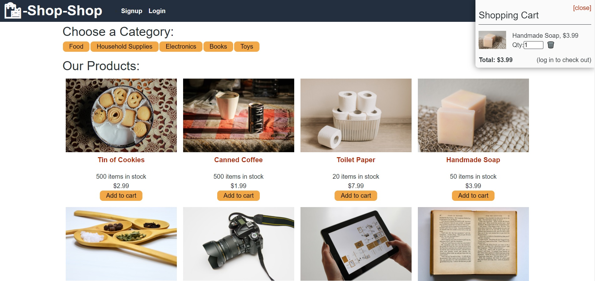

# Shop-shop-Redux
- React shopping app with Redux managing global state and Stripe integration for checkout
- App cloned from the [shop-shop](https://github.com/SteveB29/shop-shop) repo which was built following Uconn's coding bootcamp
- This app is refactored to use Redux as it's global state instead of Context API
- Utilizes Redux's Provider component to make the store accessible to all nested components
- Uses useDispatch to dispatch all state updates to make a new state
- Uses useSelector to subscribe to state data

## Deployed application and GitHub
- [Deployed application](https://cryptic-thicket-99291.herokuapp.com/)
- [GitHub repo](https://github.com/SteveB29/shop-shop-Redux)

## Screenshot of application

## Contact me
- [GitHub](https://github.com/SteveB29)
- [Email](mailto:steven.bendrick@gmail.com)